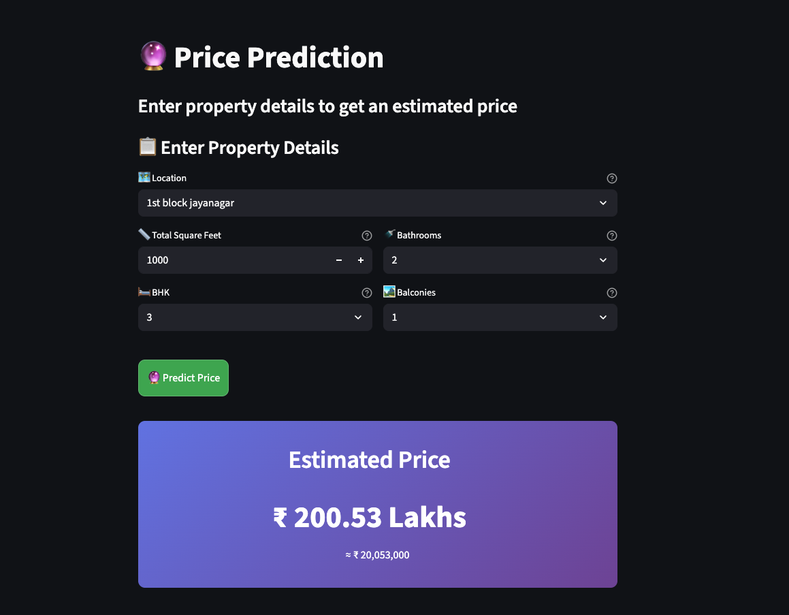
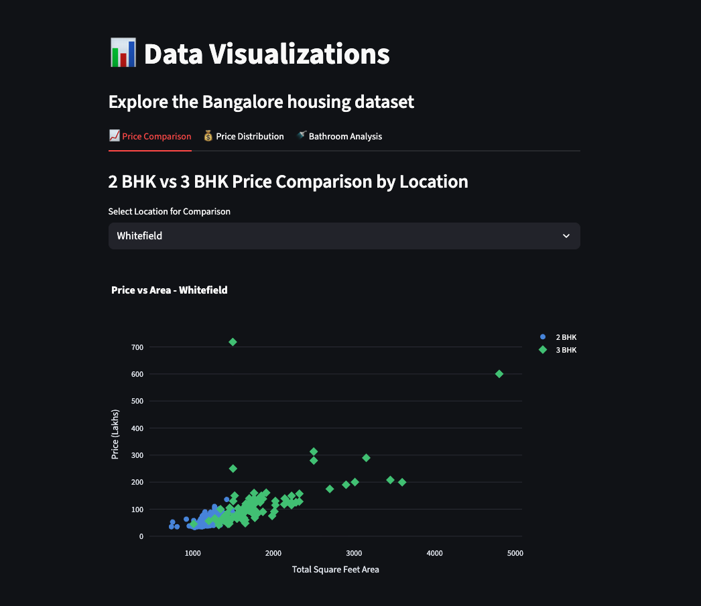
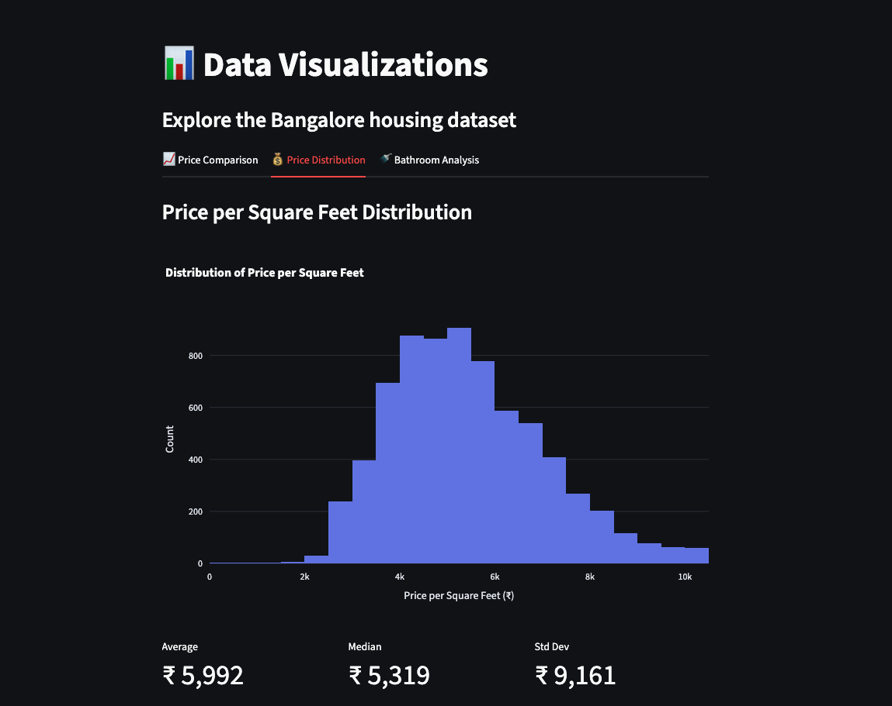

# Bangalore_Housing_Prediction
Bangalore Housing Prediction Using Python, Machine Learning & Streamlit

🚀 **Live Demo:** [https://tb-bangalore-housing-prediction.streamlit.app/](https://tb-bangalore-housing-prediction.streamlit.app/)

## 📸 Screenshots

### Price Prediction

*Interactive price prediction with real-time estimates and property details*

### Data Visualization - Price Analysis

*2 BHK vs 3 BHK price comparison across different locations*

### Data Visualization - Price Distribution

*Distribution of price per square feet with statistical metrics*

## ✨ Features

- 🏠 **Interactive Price Prediction** - Get instant house price estimates
- 📊 **Data Visualizations** - Explore price trends and distributions
- 🗺️ **237+ Locations** - Covers major areas across Bangalore
- 🎨 **Modern UI/UX** - Beautiful gradient design with smooth animations
- 🔊 **Sound Effects** - Interactive audio feedback for better UX
- 📱 **Responsive Design** - Works seamlessly on all devices
- 🚀 **Live Deployment** - Hosted on Streamlit Cloud

## 📊 Dataset Information

### Bengaluru House Price Data
This dataset contains housing data from Bengaluru (Bangalore), India, and is widely used for real estate price prediction, data analysis, and regression modeling, especially in the context of Indian urban markets.

#### Dataset Summary
- **Source:** Kaggle (Bengaluru House Price Data)
- **File:** `Bengaluru_House_Data.csv`
- **Size:** ~938 KB
- **Popularity:** 89K+ downloads, 321K+ views on Kaggle
- **License:** CC0: Public Domain—free for use without restriction

#### Year/Timeframe
- **Data Collection Years:** Primarily 2017–2018, with some entries possibly up to 2019 or 2020
- **Example availability dates:** "18-Dec", "19-Dec", "20-Dec", "21-Dec" suggest listings primarily in 2017–2018

#### Features / Columns

| Column Name | Description |
|------------|-------------|
| `area_type` | Type of area (e.g., super built-up, plot area, built-up) |
| `availability` | Availability status or date (e.g., ready to move, 18-Dec) |
| `location` | Area within Bengaluru |
| `size` | Number of bedrooms (BHK), e.g., '2 BHK' |
| `society` | Name of housing society (many entries are null) |
| `total_sqft` | Total covered area (sq ft) |
| `bath` | Number of bathrooms |
| `balcony` | Number of balconies |
| `price` | Price (in lakhs; 1 lakh = 100,000 INR) |

#### Sample Entries
- Super built-up Area | Ready To Move | Whitefield | 2 BHK | DuenaTa | 1170 | 2 | 1 | 38
- Plot Area | Ready To Move | Gandhi Bazar | 6 Bedroom | 1020 | 6 | 370
- Built-up Area | Ready To Move | Uttarahalli | 3 BHK | 1440 | 2 | 3 | 62

#### Use Cases
- Predicting house prices in Bengaluru using machine learning models
- Exploratory data analysis and visualization
- Studying impact of features like size, locality, and amenities on price
- Market pattern analysis post-demonetization, regulatory changes, etc.

#### Tags
Real estate, Regression, India, Data cleaning, Housing market

---

## 📁 Project Structure

```
Bangalore_Housing_Prediction/
├── app.py                      # Main Streamlit application
├── requirements.txt            # Project dependencies
├── README.md                   # Project documentation
├── .gitignore                  # Git ignore rules
│
├── data/                       # Dataset files
│   └── Bengaluru_House_Data.csv
│
├── notebooks/                  # Jupyter notebooks for analysis
│   └── CodeBasics Data Science Project - Housing Price Prediction.ipynb
│
├── screenshots/                # App screenshots
│   ├── prediction.png
│   ├── price-analysis.png
│   └── price-distribution.png
│
├── src/                        # Source code
│   ├── models/                 # Trained models
│   │   └── artifacts/
│   │       ├── bangalore_home_prices_model.pickle
│   │       └── columns.json
│   │
│   └── utils/                  # Utility scripts
│       └── retrain_model.py    # Model training script
│
└── .venv/                      # Virtual environment (gitignored)
```

## 🚀 Quick Start

1. Clone the repository:
```bash
git clone <repository-url>
cd Bangalore_Housing_Prediction
```

2. Create a virtual environment (recommended):
```bash
python -m venv .venv
source .venv/bin/activate  # On Windows: .venv\Scripts\activate
```

3. Install dependencies:
```bash
pip install -r requirements.txt
```

4. Run the Streamlit app:
```bash
streamlit run app.py
```

5. Open your browser to `http://localhost:8501`

## 📦 Deployment

**Live Application:** [https://tb-bangalore-housing-prediction.streamlit.app/](https://tb-bangalore-housing-prediction.streamlit.app/)

The application is deployed on Streamlit Community Cloud and is freely accessible to anyone.

## 🛠️ Technology Stack

- **Frontend**: Streamlit
- **Machine Learning**: scikit-learn (Linear Regression)
- **Data Visualization**: Plotly, Matplotlib
- **Data Processing**: Pandas, NumPy
- **Model Serialization**: Pickle
- **Deployment**: Streamlit Community Cloud

## 🔧 Retrain Model

To retrain the model with updated data:

```bash
cd src/utils
python retrain_model.py
```

This will:
- Load data from `data/Bengaluru_House_Data.csv`
- Clean and preprocess the data
- Train a Linear Regression model
- Save the model to `src/models/artifacts/`

## 📈 Model Performance

- **Algorithm**: Linear Regression
- **R² Score**: 0.8585
- **Training Samples**: 6,958 properties
- **Features**: 241 (including location encodings)
- **Cross-validation**: 5-fold shuffle split
